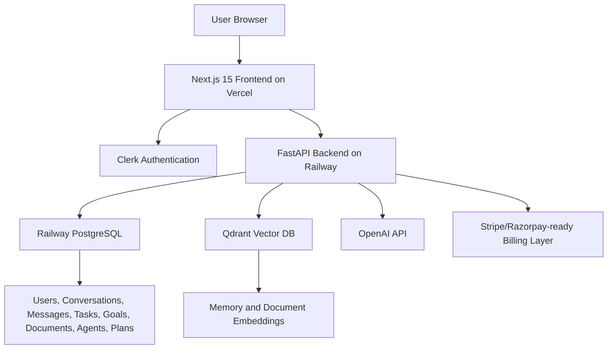

# HumanOS AI Technical Architecture

## Overview
HumanOS AI is a full-stack white-label AI SaaS platform with a Next.js frontend, FastAPI backend, PostgreSQL database, Qdrant vector search, Clerk authentication, OpenAI integration, and deployment configuration for Vercel and Railway.

## Architecture Diagram

## Frontend
- Next.js 15
- React
- TypeScript
- Tailwind CSS
- Shadcn-style components
- Clerk frontend auth
- Responsive dashboard UI
- Dark/light theme
- Vercel deployment

## Backend
- FastAPI
- SQLAlchemy
- Pydantic
- PostgreSQL persistence
- Clerk JWT verification
- OpenAI chat and agent generation
- Qdrant vector search
- CORS configured for Vercel
- Railway deployment

## Database
PostgreSQL stores users, conversations, messages, memories, tasks, goals, milestones, documents, job matches, resume versions, agents, daily plans, and subscriptions.

## Vector Search
Qdrant stores long-term memory embeddings and document chunk embeddings.

## Buyer-Owned Infrastructure
The buyer supplies own domain, API keys, database, auth account, OpenAI billing, vector database account, and payment gateway.
